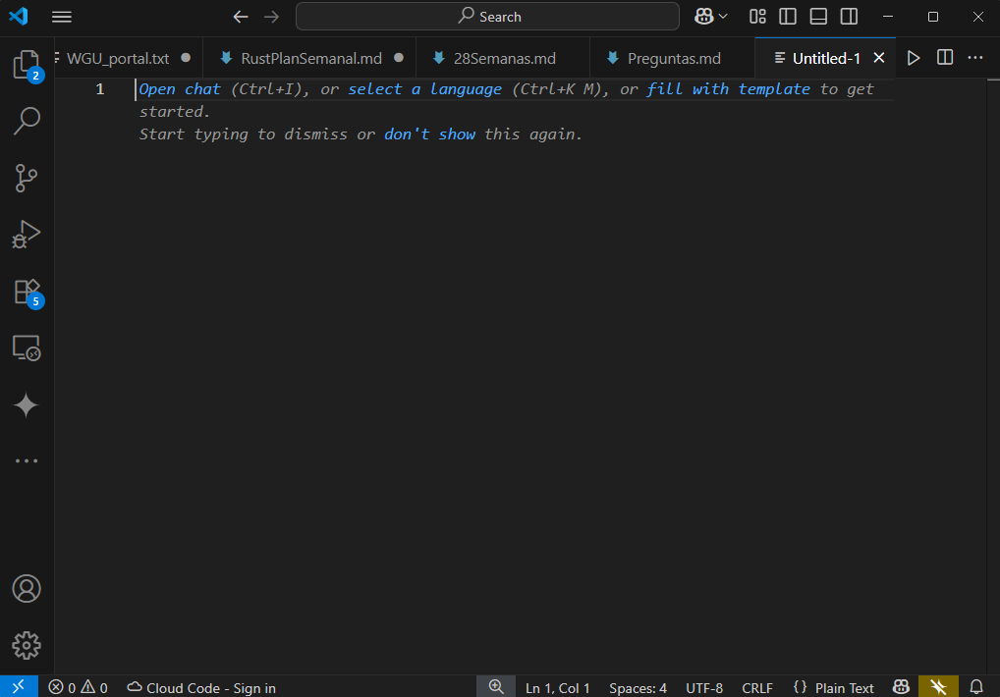
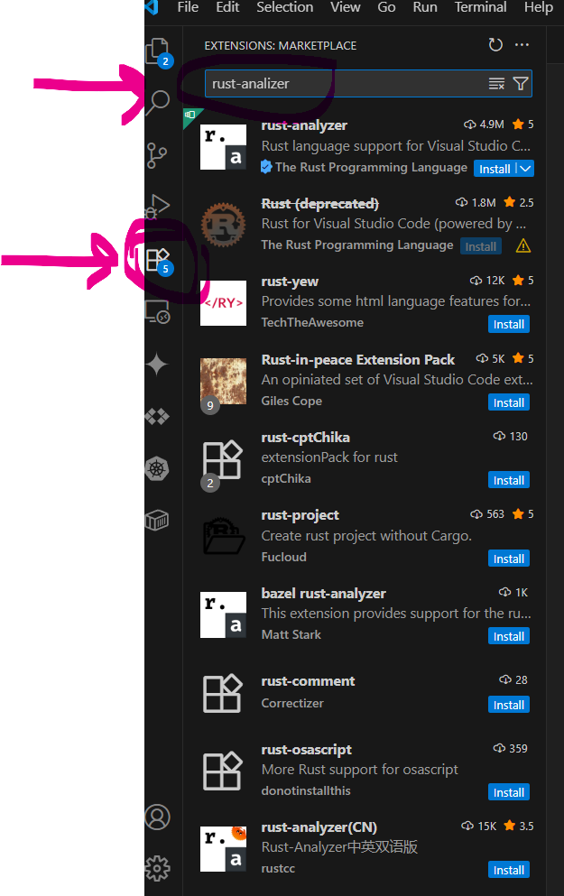
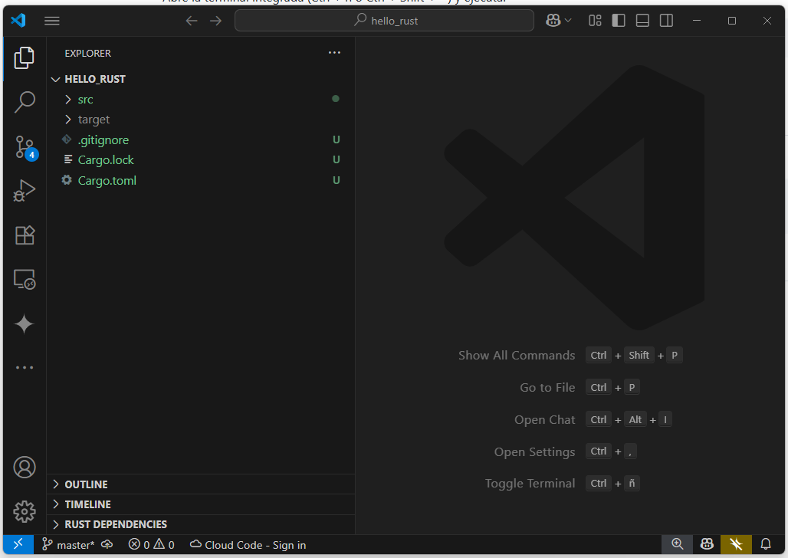

# Evidencia.
## 1. 🧰 Instalar Visual Studio Code

## 2. 🧩 Instalar la extensión rust-analyzer

Una vez instalada la extención se reinició VSC.

## 3. 📂 Abrir el proyecto hello_rust desde VSCode

## 4. 🧪 Validar funcionalidades básicas

### Autocompletado
### Go to definition
### Hover info

### Errores en línea.

## 5. ▶ Ejecutar desde el terminal del editor

## 6. 🎯 Ejecutar cargo fmt y cargo clippy desde VSCode

